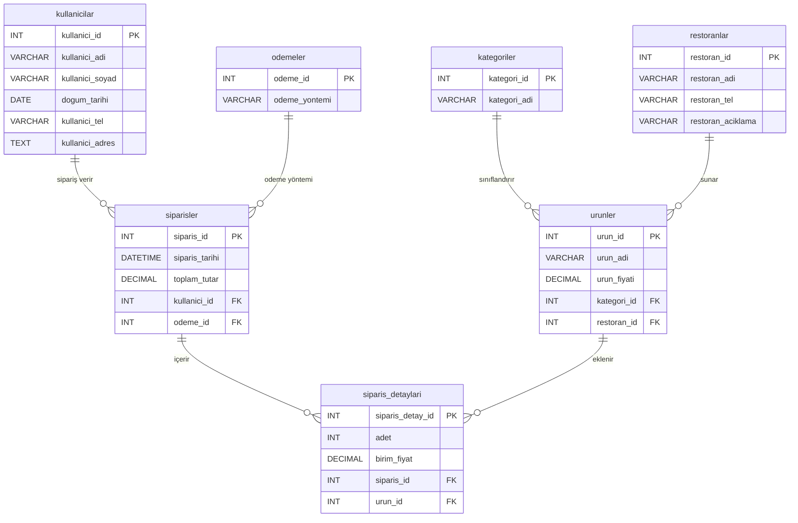

# Yemek Siparişi Veritabanı Projesi

## 🗄️ Veritabanı Şeması (ER Diyagramı)

Aşağıdaki şema, veritabanındaki tabloları ve birbirleriyle olan ilişkilerini göstermektedir:

## 📋 Tablolar ve Özellikleri

Veritabanı temel olarak aşağıdaki tablo yapılarından oluşur:

*   **`kullanicilar`**: Sisteme kayıtlı müşterilerin bilgilerini tutar.
    *   *Öznitelikler:* `kullanici_id` (PK), `kullanici_adi`, `kullanici_soyad`, `dogum_tarihi`, `kullanici_tel`, `kullanici_adres`
*   **`restoranlar`**: Sistemde yemek satan restoranların bilgilerini tutar.
    *   *Öznitelikler:* `restoran_id` (PK), `restoran_adi`, `restoran_tel`, `restoran_aciklama`
*   **`kategoriler`**: Ürünlerin sınıflandırıldığı yemek kategorileridir (Tatlılar, Çorbalar vb.).
    *   *Öznitelikler:* `kategori_id` (PK), `kategori_adi`
*   **`urunler`**: Restoranların sunduğu yemeklerin ve ürünlerin bilgilerini tutar.
    *   *Öznitelikler:* `urun_id` (PK), `urun_adi`, `urun_fiyati`, `kategori_id` (FK), `restoran_id` (FK)
*   **`odemeler`**: Siparişler için kullanılan ödeme yöntemlerini tutar (Nakit, Kredi Kartı vb.).
    *   *Öznitelikler:* `odeme_id` (PK), `odeme_yontemi`
*   **`siparisler`**: Müşterilerin verdiği genel siparişlerin (sepetin) üst bilgisini tutar.
    *   *Öznitelikler:* `siparis_id` (PK), `siparis_tarihi`, `toplam_tutar`, `kullanici_id` (FK), `odeme_id` (FK)
*   **`siparis_detaylari`**: Bir sipariş sepetinin içinde bulunan spesifik ürünleri ve adetlerini tutar.
    *   *Öznitelikler:* `siparis_detay_id` (PK), `adet`, `birim_fiyat`, `siparis_id` (FK), `urun_id` (FK)

## 🔍 Görünümler (Views)

*   **`siparis_iletisim_bilgileri`**: Bir sipariş ile ilgili hem restoranın hem de kullanıcının telefon numarası bilgilerine aynı anda, tablo birleştirmelerine (JOIN) gerek kalmadan hızlıca erişim sağlayan bir sanal tablodur (View).
